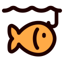

  

      <h1>
      
       
      LazyFish
    </h1>
     
  

  

  

## Introduce

 

> 本项目已收录于 [Product](https://product.xmuli.tech/) 
>

My first WinUI3 project, It's also an easy tutorial to get started, and uploaded to the Microsoft Store.

第一个 WinUI3 项目，也是一个简单的入门教程，并且上架微软商店。

## Website

**GitHub:** [LazyFish](https://github.com/XMuli/LazyFish)

**Website:** [https://lazyfish.xmuli.tech](https://lazyfish.xmuli.tech/) 

The computer displays a blue screen or a live system update video to get yourself a cup of coffee and a nap.

假装电脑蓝屏、或系统带进度实时更新，让自己喝杯咖啡，小憩一会。

