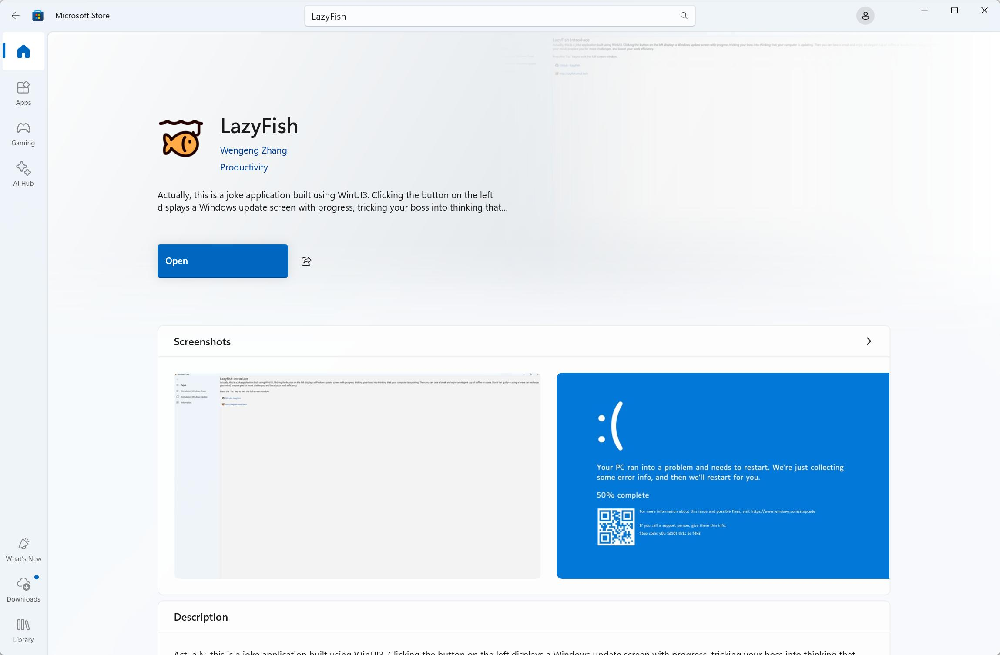

# LazyFish

The computer displays a blue screen or a live system update video to get yourself a cup of coffee and a nap.

电脑假装蓝屏、或系统带进度实时更新，让自己喝杯咖啡，小憩一会。

 

# Site

Office Home: [https://lazyfish.xmuli.tech](https://lazyfish.xmuli.tech/)

 

# Show

# Build

**Software Tool**

Development

- Visual Studio 2022
- [WinUI-Gallery](https://github.com/microsoft/WinUI-Gallery)
- [Windows Community Toolkit Gallery](https://apps.microsoft.com/detail/9nblggh4tlcq?hl=en-US&gl=US)
- [Character Map UWP](https://apps.microsoft.com/detail/9wzdncrdxf41?rtc=1&hl=zh-CN&gl=CN)

**NuGet Package:**

- Microsoft.WindowsAppSDK

**Ref:**

- [WinUI 3——从入门到放弃](https://blog.panpili.com/2022/coding/dotnet/quit-winui-now/)
- [WinUI 3 踩坑记](https://github.com/Scighost/WinUI3Keng)

# Note

> My first WinUI3 project 
>
> 我的第一个 WinUI3 项目
